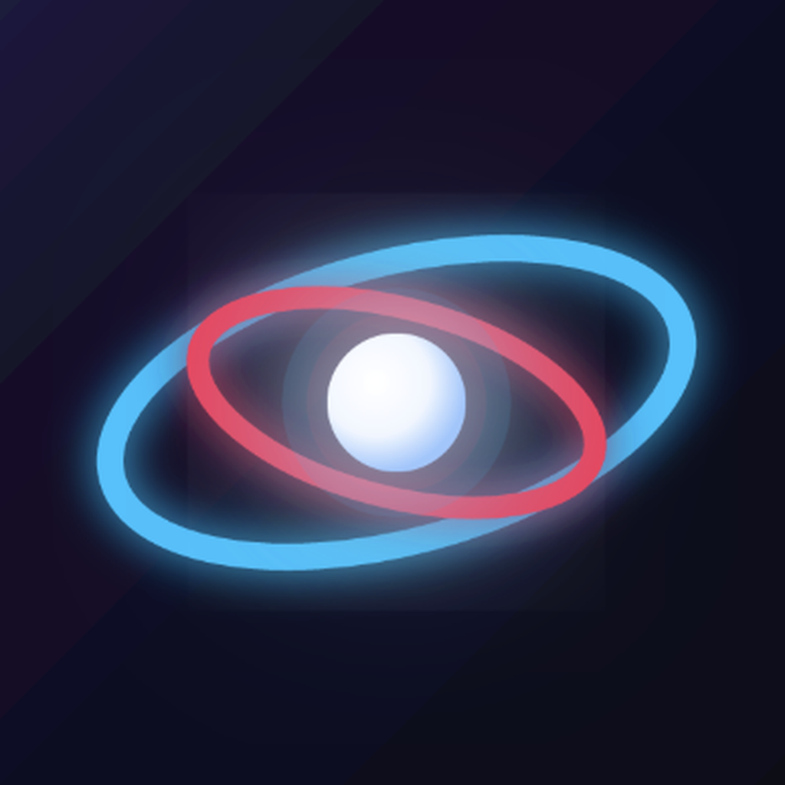
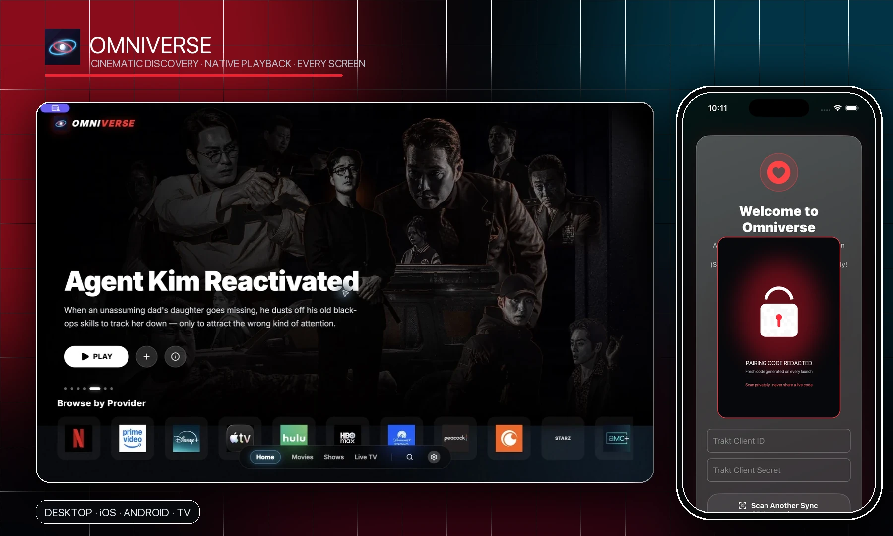
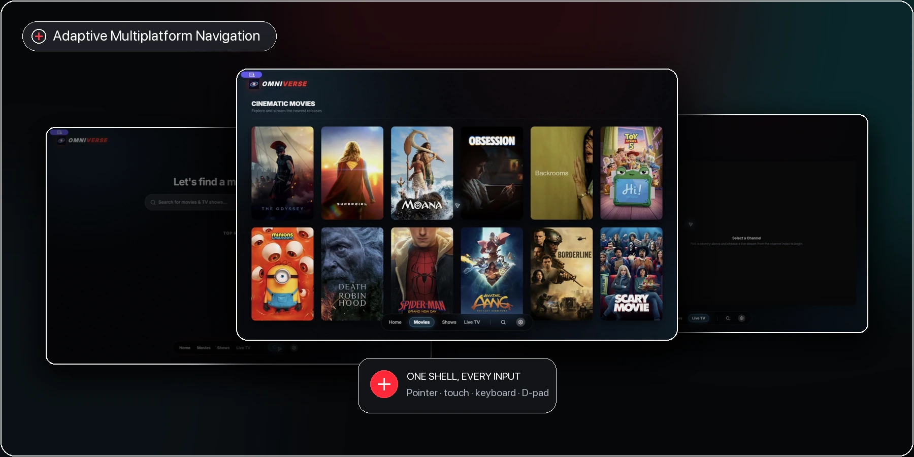
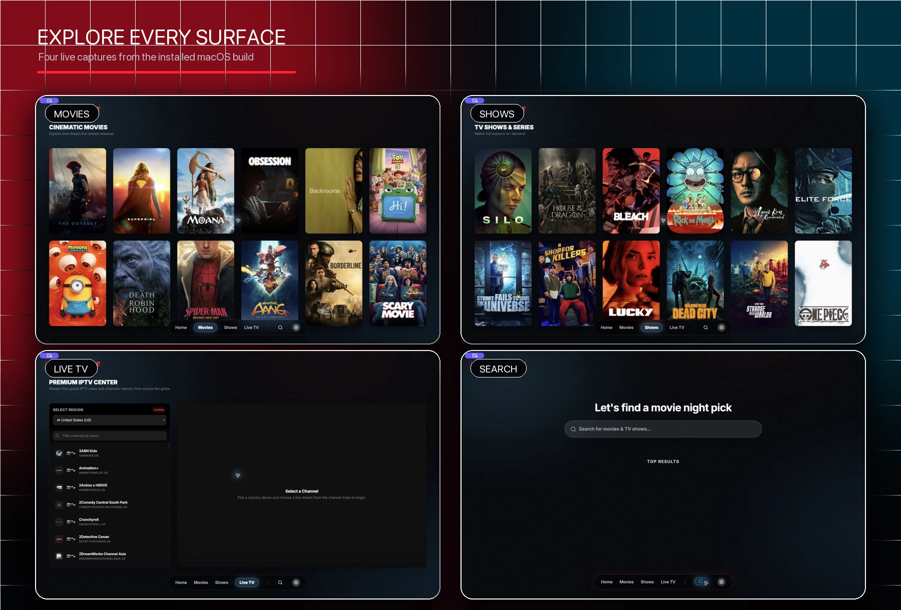
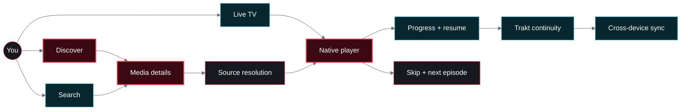
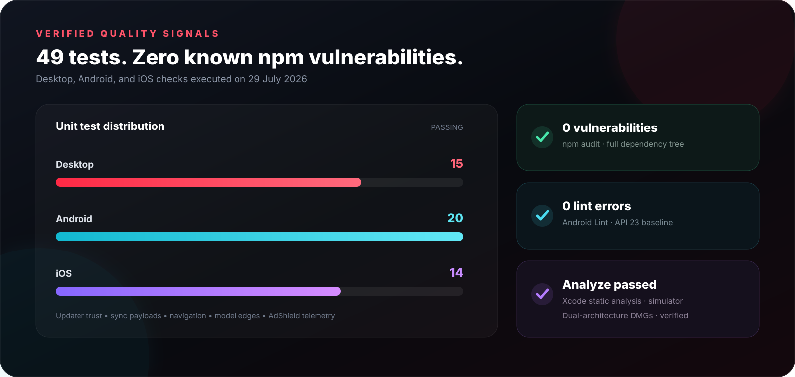
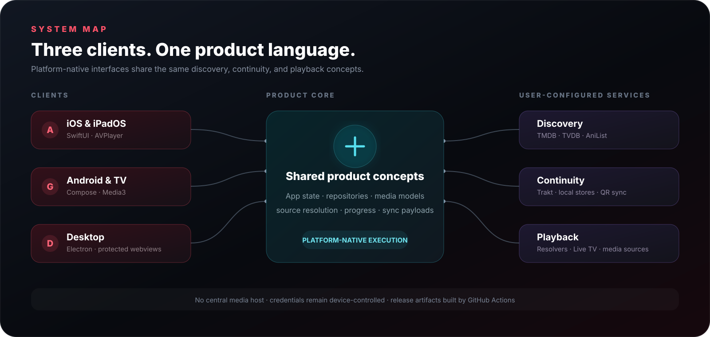

<a id="readme-top"></a>

<div align="center">
  
  <h1>Omniverse</h1>
  <p><strong>A cinematic media companion for every screen.</strong></p>
  <p>Native on iPhone, iPad, Android, and TV. Immersive on Windows, macOS, and Linux.</p>

  <p>
    <a href="https://github.com/FiNiX-GaMmA/omniverse/releases/latest"><strong>Download</strong></a>
    · <a href="API_SETUP.md">Configure</a>
    · <a href="CHANGELOG.md">Changelog</a>
    · <a href="https://github.com/FiNiX-GaMmA/omniverse/issues">Issues</a>
  </p>

  <p>
    <a href="https://github.com/FiNiX-GaMmA/omniverse/actions/workflows/build.yml"></a>
    <a href="https://github.com/FiNiX-GaMmA/omniverse/releases/latest"></a>
    <a href="LICENSE"></a>
  </p>

  <p>
    
    
    
  </p>
</div>



<p align="center"><sub>Real installed macOS and iOS Simulator captures. The live pairing code is redacted.</sub></p>

> [!IMPORTANT]
> Omniverse is a client application. It does not host or distribute media. Connect only accounts and playback endpoints you are authorized to use.

## A living-room experience, everywhere

Omniverse borrows the visual confidence of modern streaming platforms—large artwork, quiet controls, deep black surfaces, and luminous glass—without forcing one platform’s interaction model onto another.



| Discover | Watch | Continue |
| :--- | :--- | :--- |
| Hero stories, provider rails, Top 10 shelves, search, anime, and live TV. | AVPlayer on Apple platforms, Media3 on Android, protected webviews on desktop. | Local history, Trakt watchlists and scrobbling, resume state, and cross-device sync. |

### Designed for the screen—not stretched across it

| Phone | Tablet & TV | Desktop |
| :--- | :--- | :--- |
| Thumb-reachable glass navigation, portrait-aware heroes, compact actions, and native sheets. | Adaptive poster grids, larger rails, D-pad focus, generous targets, and landscape playback. | Frameless cinematic canvas, floating dock navigation, keyboard search, PiP, and live AdShield telemetry. |

## Product tour

The gallery below combines the **Movies**, **Shows**, **Live TV**, and **Search** tabs from the installed macOS app into one compact showcase—no padded canvases or oversized hidden galleries.



<p align="center"><sub>Live application captures. Catalogue artwork and service marks belong to their respective owners.</sub></p>

### Native mobile, same cinematic language

The iOS and Android redesign carries the desktop atmosphere into responsive SwiftUI and Jetpack Compose surfaces:

- Edge-to-edge artwork and adaptive hero composition from phone to tablet.
- Floating bottom navigation with safe-area awareness and one-handed reach.
- Touch-sized actions, native sheets, platform typography, and OS-native playback.
- Consistent crimson, cyan, glass, spacing, and motion tokens without hiding platform conventions.

## Experience flow



## Verified quality & security



| Check | Result | Coverage |
| :--- | :---: | :--- |
| `npm test` | **14 / 14 passed** | AdShield telemetry, signed updater, trusted URLs, Electron isolation, secret scan |
| `./gradlew testDebugUnitTest` | **20 / 20 passed** | Navigation, sync payloads, models, streams, progress, Android updater edges |
| `xcodebuild … test` | **14 / 14 passed** | Sync compatibility, credentials, models, playback overrides, state edges |
| `npm audit --audit-level=high` | **0 vulnerabilities** | Full desktop dependency tree, including development packaging tools |
| `./gradlew lintDebug` | **Passed · 0 errors** | API-level compatibility and Android static checks |
| `xcodebuild … analyze` | **Passed** | Swift/Clang static analysis |
| `npm run pack` | **Passed** | Electron 43 arm64 app packaged and signed locally |

### Security baseline

- Electron runs its renderer and playback guests with context isolation, no Node integration, and Chromium sandboxing.
- Desktop and Android updaters accept only HTTPS assets under the official repository’s release path and expected package type.
- Android uses platform TLS and hostname verification; invalid or self-signed certificates are rejected.
- iOS keeps API traffic under App Transport Security while limiting exceptions to user-selected media, web content, and local networking.
- Android signing material is excluded from source. CI reconstructs it from masked repository secrets.
- iOS credentials use Keychain; Android credentials use encrypted preferences.

> [!CAUTION]
> A live `OMNIVERSE-SYNC1` QR contains credentials encoded as Base64. Base64 is not encryption. Treat a live pairing code like a password and never publish it.

## Platform matrix

| Platform | Interface & playback | Release output | Minimum |
| :--- | :--- | :--- | :--- |
| Android phones & tablets | Kotlin, Compose, Media3 | Universal + ARM64 APK | Android 6 / API 23 |
| Android TV & Fire TV | Compose for TV, D-pad focus, Media3 | Universal APK | Android 6 / API 23 |
| iPhone & iPad | SwiftUI, AVPlayer | Unsigned IPA | iOS / iPadOS 17 |
| Windows | Electron | NSIS installer + portable EXE | Windows x64 |
| macOS | Electron | Signed DMG | Apple Silicon (M1–M4) + Intel |
| Linux | Electron | AppImage + Debian package | Linux x64 |

Download current packages from [GitHub Releases](https://github.com/FiNiX-GaMmA/omniverse/releases/latest).

## Architecture



<details>
  <summary><strong>Repository map</strong></summary>

```text
omniverse/
├── android/               Kotlin + Jetpack Compose app and tests
├── ios/                   SwiftUI app, XCTest suite, and XcodeGen spec
├── desktop/               Electron app, AdShield, updater, and Node tests
├── assets/branding/       Shared brand assets
├── docs/readme/           Real captures and README visualizations
├── graphify-out/          Interactive knowledge graph and architecture report
├── API_SETUP.md           Credential setup guide
├── SYNC_SPEC.md           Cross-device payload specification
└── .github/workflows/     Multiplatform build, signing, and release automation
```

Explore the [interactive code graph](graphify-out/graph.html) or read the [architecture report](graphify-out/GRAPH_REPORT.md).

</details>

## Quick start

<details open>
  <summary><strong>Desktop</strong></summary>

```bash
cd desktop
npm ci
npm test
npm start
```

</details>

<details>
  <summary><strong>Android</strong></summary>

```bash
cd android
./gradlew testDebugUnitTest assembleDebug
```

Or build and install to a connected device from the repository root with `./install_android.sh`.

</details>

<details>
  <summary><strong>iOS / iPadOS</strong></summary>

```bash
cd ios
xcodegen
open Omniverse.xcodeproj
```

For a connected iPhone or iPad, the repository also includes `./install_ipad.sh`.

</details>

## Configuration

Omniverse talks directly to services using credentials you control. See the [complete API setup guide](API_SETUP.md).

| Service | Purpose | Requirement |
| :--- | :--- | :--- |
| TMDB | Discovery, artwork, details, cast, and search | Required for the full movie and TV catalogue |
| Trakt | Onboarding, watchlists, scrobbling, progress, and backup | Required by the native onboarding flow |
| TVDB | Supplemental TV metadata | Optional |
| Pixeldrain | Service-specific transfer limits | Optional |
| AniList | Anime discovery and account integration | Optional |

## Release signing

Desktop release versions are stamped by CI. Android signing is restored at build time from:

- `ANDROID_KEYSTORE_BASE64`
- `ANDROID_KEYSTORE_PASSWORD`
- `ANDROID_KEY_ALIAS`
- `ANDROID_KEY_PASSWORD`

For local Android release builds, copy `android/keystore.properties.example` to the ignored `android/keystore.properties` file and keep the keystore outside version control.

## Privacy & sync

- Omniverse does not operate a central catalogue or media-hosting service.
- Credentials remain on the device unless you explicitly start a sync flow.
- Trakt can hold watch state and a private settings backup in your own account.
- Desktop credentials live in the Electron profile; native credentials use OS-backed stores.

Read the byte-level pairing format and restore rules in [SYNC_SPEC.md](SYNC_SPEC.md).

## Contributing

1. Create a focused branch.
2. Preserve native platform behavior and the shared visual language.
3. Run the relevant tests, lint/analyze checks, and security audit.
4. Include screenshots for visible UI changes.

Issues, accessibility improvements, focused pull requests, and design feedback are welcome.

## License

Released under the [MIT License](LICENSE).

<p align="center"><a href="#readme-top">Back to top ↑</a></p>
